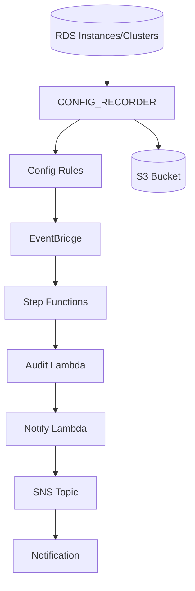

# RDS暗号化監査システム (Consolidated README)

AWS Config / EventBridge / Step Functions / Lambda / SNS / S3 を組み合わせ、RDS インスタンス / クラスター / パラメーターグループの暗号化およびセキュリティ関連設定を継続監査し、非準拠イベントをリアルタイム通知する仕組みです。複数の Markdown ドキュメント (ARCHITECTURE.md / existing-config-guide.md / IMPLEMENTATION_SUMMARY.md) の主要内容を本 README に統合しました。

## 🧩 特徴 (Key Features)

- 包括的監査: RDS インスタンス暗号化・スナップショット暗号化・削除保護・パラメーターグループ設定
- リアルタイム検知: Config Compliance Change (NON_COMPLIANT) を EventBridge で捕捉し通知
- 既存リソース再利用: SNS / S3 / Config Recorder / Delivery Channel / Config Role / Lambda Role の ARN 指定による再利用
- 設定ファイル駆動: JSON による宣言的設定 (新規/既存切替)
- コスト最適化: 既存リソース活用で重複課金を回避
- 拡張容易: 追加 Managed Rule / Custom Rule / 通知チャネル拡張に対応しやすい構造

## 🏗️ アーキテクチャ概要

```text
RDS Resources → Config Recorder → Config Rules → EventBridge → Step Functions → (Audit Lambda → Notify Lambda) → SNS → Email/Etc
             ↓
          S3 (Config履歴)
```

Mermaid (概念図):



### データフロー (High Level)

1. Config Recorder が RDS 関連リソース (DBInstance/DBCluster/ParameterGroup) を記録
2. Config Rules (Managed + Custom) が評価し NON_COMPLIANT を生成
3. EventBridge ルールがフィルタし Step Functions を起動
4. 監査 Lambda がイベント内容を整形 (必要に応じ詳細取得) → 通知 Lambda が SNS Publish
5. 受信者 (Email など) がアラート受領

## 🔍 監査対象

### Managed / Custom Rules

- Managed: `RDS_STORAGE_ENCRYPTED`
- Custom: `rds-parameter-group-settings-check` (パラメーターグループ内の特定キー値を評価)

### 追加ロジック (Lambda 内部例)

- 暗号化有無 / KMS キー種別
- 削除保護フラグ
- パラメーターグループ セキュリティ関連 (例: `require_secure_transport`, `ssl`, `log_statement` 他)

## ♻️ 既存リソース再利用 (設定キー)

| 種別 | プロパティ例 | 再利用 | 新規 |
|------|--------------|--------|------|
| SNS Topic | `sns.existingTopicArn` | ✅ | ✅ |
| S3 Bucket | `s3.existingBucketArn` | ✅ | ✅ |
| Config Role | `config.existingConfigRoleArn` | ✅ | ✅ |
| Configuration Recorder | `config.existingConfigurationRecorderArn` | ✅ | ✅ |
| Delivery Channel | `config.existingDeliveryChannelArn` | ✅ | ✅ |
| Lambda Role | `iam.existingLambdaRoleArn` | ✅ | ✅ |

ベストプラクティス: 既存リソースを使わない場合、空文字列ではなくプロパティごと削除。

```json
// ✅ 良い例 (新規作成を許可)
{ "sns": { "topicName": "rds-encryption-audit-notifications", "emailAddress": "sec@example.com" } }
// ❌ 悪い例 (空文字列は混乱の元)
{ "sns": { "existingTopicArn": "" } }
```

## 🚀 クイックスタート (Quick Start)

## 📋 監査対象

### AWS Config Managed Rules

- **RDS_STORAGE_ENCRYPTED**: RDSインスタンスのストレージ暗号化チェック
- **rds-parameter-group-settings-check (カスタムルール)**: RDSパラメータグループのTDE（Transparent Data Encryption）などの設定を監査します。

### 通知トリガー

- Config Rule違反検出時の即座通知
- コンプライアンス状態変更の追跡
- 詳細な問題分析とレコメンデーション

## ⚙️ 既存リソース活用

**🎯 重要な特徴**: このシステムは既存のAWS Config環境と統合できます。

### 対応リソース

| リソース | 設定項目 | 既存利用 | 新規作成 |
|---------|---------|---------|---------|
| SNS Topic | `sns.existingTopicArn` | ✅ | ✅ |
| S3 Bucket | `s3.existingBucketName` | ✅ | ✅ |
| Config Role | `config.existingConfigRoleArn` | ✅ | ✅ |
| Configuration Recorder | `config.existingConfigurationRecorderArn` | ✅ | ✅ |
| Delivery Channel | `config.existingDeliveryChannelArn` | ✅ | ✅ |

### 設定パターン

1. **完全新規**: 全てのリソースを新規作成
2. **ハイブリッド**: 一部既存、一部新規の混合
3. **完全統合**: 既存Config環境にルールのみ追加

詳細なパターン別例は本 README の「設定例」節を参照 (旧 docs/existing-config-guide.md を統合)。

## 🚀 クイックスタート

### 前提条件

- Node.js 18.x以上
- AWS CLI設定済み
- AWS CDK CLI: `npm install -g aws-cdk`

### 1. 環境準備

```bash
# プロジェクトクローン
git clone <repository-url>
cd detect-created-rds-parameter

# 依存関係インストール
npm install

# CDK初期化（初回のみ）
cdk bootstrap
```

### 2. 設定選択 (Deployment Patterns)

#### パターンA: デフォルト設定（全て新規作成）

```bash
# そのままデプロイ
npm run build
cdk deploy
```

#### パターンB: 既存リソース活用 (SNS + Config + S3 再利用例)

1. 設定ファイル作成：

```bash
cp config/existing-resources-config.json config/my-config.json
```

1. `config/my-config.json`を編集して既存リソースのARNを設定：

```json
{
  "sns": {
    "existingTopicArn": "arn:aws:sns:ap-northeast-1:YOUR_ACCOUNT:existing-notifications"
  },
  "config": {
    "existingConfigRoleArn": "arn:aws:iam::YOUR_ACCOUNT:role/existing-config-role",
    "existingConfigurationRecorderArn": "arn:aws:config:ap-northeast-1:YOUR_ACCOUNT:config-recorder/default",
    "existingDeliveryChannelArn": "arn:aws:config:ap-northeast-1:YOUR_ACCOUNT:delivery-channel/default"
  },
  "s3": {
    "existingBucketArn": "arn:aws:s3:::existing-config-bucket"
  }
}
```

1. 設定ファイルを指定してデプロイ：

```bash
CONFIG_FILE=config/my-config.json cdk deploy --require-approval never
```

### 3. デプロイ後の設定

#### SNS通知設定（新規作成時のみ）

1. デプロイ完了後、指定メールアドレスに確認メールが送信
2. メール内の「Confirm subscription」をクリック

#### 動作確認

```bash
# スタック情報確認
cdk list
cdk describe RdsEncryptionAuditStack

# Config Rules確認
aws configservice describe-config-rules --config-rule-names rds-storage-encrypted-check
```

## �️ 設定ファイル詳細

### 設定ファイルの場所

- `config/default-config.json`: デフォルト設定（新規作成）
- `config/existing-resources-config.json`: 既存リソース活用テンプレート
- `config/my-config.json`: カスタム設定（ユーザー作成）

### 主要設定項目

```typescript
interface StackConfig {
  // 環境設定
  environment?: {
    account?: string;
    region?: string;
    name?: string;
  };
  
  // SNS設定
  sns?: {
    existingTopicArn?: string;    // 既存Topic使用時
    topicName?: string;           // 新規作成時
    emailAddress?: string;        // 通知先メール
  };
  
  // Config設定  
  config?: {
    existingConfigRoleArn?: string;              // 既存Role
    existingConfigurationRecorderArn?: string;   // 既存Recorder
    existingDeliveryChannelArn?: string;         // 既存Channel
  };
  
  // Lambda設定
  lambda?: {
    functionName?: string;
    timeout?: number;
    memorySize?: number;
    logLevel?: string;
  };
}
```

## 🔧 運用・管理 / コマンド

### 開発用コマンド

```bash
# TypeScriptビルド
npm run build

# ファイル変更監視
npm run watch

# テスト実行
npm test

# デプロイ前差分確認
cdk diff

# CloudFormationテンプレート生成
cdk synth

# リソース削除
cdk destroy
```

### デプロイ済み環境の管理

```bash
# スタック状態確認
aws cloudformation describe-stacks --stack-name RdsEncryptionAuditStack

# Config Rules評価状況確認
aws configservice get-compliance-details-by-config-rule \
  --config-rule-name rds-storage-encrypted-check

# Lambda関数ログ確認  
aws logs describe-log-groups --log-group-name-prefix "/aws/lambda/rds-encryption"
```

## � 通知例

システムが検出する問題と通知例：

```text
🔐 RDS暗号化監査アラート

📋 詳細情報:
  リソース: my-database-instance  
  ルール: rds-storage-encrypted-check
  リージョン: ap-northeast-1
  タイムスタンプ: 2025-08-06T12:00:00.000Z

� 検出された問題:
  ❌ ストレージ暗号化が無効
  ⚠️ 削除保護が無効

🔗 推奨対応:
1. AWSコンソールでRDSインスタンス確認
2. 暗号化の有効化（要再起動）
3. 削除保護の有効化
4. スナップショット暗号化確認
```

## 💰 コストと最適化

### 月額想定コスト（ap-northeast-1）

| サービス | 使用量目安 | 月額コスト |
|---------|-----------|-----------|
| AWS Config | 設定項目100個、評価1000回 | $3-5 |
| Lambda | 月100回実行、平均1秒 | $0.01未満 |
| SNS | 通知50回 | $0.01未満 |
| S3 | Config履歴10GB | $0.25 |
| EventBridge | ルール3個、イベント100回 | $0.10 |
| **合計** | | **$3.5-5.5** |

### コスト最適化のポイント

- 既存Config環境活用でConfig料金を削減
- S3ライフサイクルルールで古いデータ自動削除
- Lambda実行時間の最適化

## 🔐 セキュリティ / IAM / データ保護

### IAM権限設計

- **最小権限の原則**: 必要最小限の権限のみ付与
- **Lambda実行ロール**: RDS読み取り、SNS送信のみ
- **Config Service Role**: AWS管理ポリシー使用

### データ保護

- **転送時暗号化**: 全てのAPIコールでHTTPS使用
- **保存時暗号化**: S3バケットでデフォルト暗号化
- **ログ暗号化**: CloudWatch Logsで自動暗号化

### コンプライアンス考慮事項

- AWS Config記録データの保持期間設定
- 監査ログの改ざん防止（S3 Object Lock対応可能）
- アクセスログの記録と監視

## 🧪 テスト / 品質保証

### 単体テスト

```bash
# 全テスト実行
npm test

# カバレッジ付きテスト
npm test -- --coverage

# 特定テストファイル実行
npm test -- rds-encryption-audit-stack.test.ts
```

### 統合テスト

```bash
# テスト環境セットアップ
./scripts/setup-test-env.sh

# テスト環境クリーンアップ  
./scripts/cleanup-test-env.sh
```

### 実環境での動作確認

1. 非暗号化RDSインスタンス作成
2. Config Rules評価トリガー
3. 通知受信確認
4. リソース削除

## 🚨 トラブルシューティング

### よくある問題と解決方法

| 問題 | 原因 | 解決方法 |
|------|------|---------|
| 通知が届かない | SNS購読未確認 | メール確認リンクをクリック |
| Config評価されない | Recorder無効 | Configuration Recorder有効化 |
| Lambda関数エラー | 権限不足 | IAMロール権限確認 |
| "default already exists" | リソース名競合 | 既存リソースARN指定 |

### ログ確認手順

```bash
# Lambda関数ログ
aws logs tail /aws/lambda/rds-encryption-audit-prod --follow

# Config評価履歴
aws configservice describe-compliance-by-config-rule \
  --config-rule-names rds-storage-encrypted-check

# EventBridge実行履歴
aws events list-rule-names-by-target --targets '{"Id":"1","Arn":"<lambda-arn>"}'
```

## 📚 参考リンク

- (統合済) アーキテクチャ詳細: 本 README 冒頭「アーキテクチャ概要」節を参照
- (統合済) 既存リソース利用ガイド: 「既存リソース再利用」「設定ファイル詳細」節を参照
- [AWS Config開発者ガイド](https://docs.aws.amazon.com/config/latest/developerguide/)
- [AWS CDK Developer Guide](https://docs.aws.amazon.com/cdk/v2/guide/)

## 🤝 貢献 (Contribution)

### 貢献方法

1. リポジトリをフォーク
2. フィーチャーブランチ作成: `git checkout -b feature/amazing-feature`
3. 変更コミット: `git commit -m 'Add amazing feature'`
4. ブランチプッシュ: `git push origin feature/amazing-feature`
5. プルリクエスト作成

### 問題報告

- バグ報告: GitHub Issues
- 機能要求: GitHub Discussions
- セキュリティ問題: 非公開で連絡

## 📄 ライセンス

このプロジェクトは [MIT License](LICENSE) の下で公開されています。

---

---

## 🧪 拡張テスト環境 (Optional)

`./scripts/setup-test-env.sh` で意図的に非準拠な RDS インスタンス & パラメーターグループを作成し、通知フローを検証できます。コスト発生に注意し終了後 `cleanup-test-env.sh` を実行してください。

## 🧭 今後の拡張候補

- 追加 Managed / Custom Rules (TDE, IAM DB Auth 等)
- Slack / Teams Webhook 通知
- CloudWatch Dashboard / Grafana 可視化
- マルチリージョン集約 (中央アカウント集約)

## ✅ 実装済ハイライト (Former Implementation Summary)

- 既存リソース ARN 指定機能
- 条件分岐による新規/既存リソース生成制御
- 型安全 (TypeScript) と設定ファイル駆動
- Step Functions による監査+通知パイプライン
- カスタム Config Rule (パラメーターグループ) 実装

## 🏁 ライセンス

MIT License

> 本 README は複数ドキュメントを統合し最新化したため、旧 `ARCHITECTURE.md` / `docs/existing-config-guide.md` / `IMPLEMENTATION_SUMMARY.md` は削除済みです。
